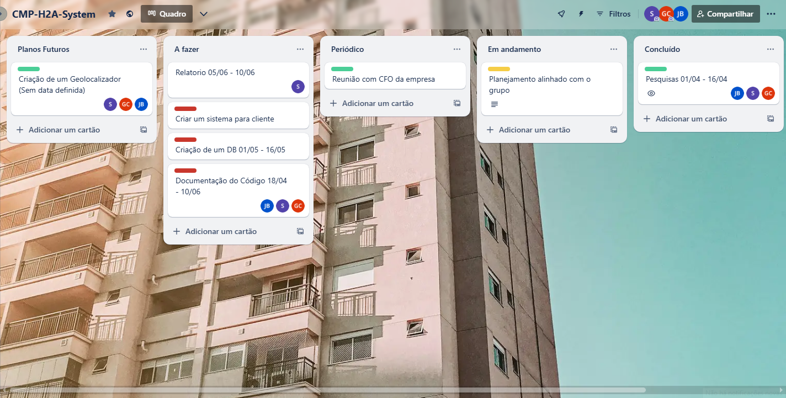

# CMP-H2A-System
  
**Documentação do Sistema**  
**\<ATENÇÃO\>**

\<BAIXE ESTE DOCUMENTO PARA SUA MÁQUINA. INSIRA ESTE ARQUIVO NO GITHUB (DEIXE COMO RAW). COMPARTILHE O LINK COM O ORIENTADOR. profkesede64@gmail.com\>

\<APAGUE TODAS AS INSTRUÇÕES EM VERMELHO DA SUA CÓPIA. AS INSTRUÇÕES PODERÃO SER CONSULTADAS A PARTIR DESTE ORIGINAL.\>

\<PARA PREENCHIMENTO DA SUA CÓPIA, SIGA AS DATAS NO ARQUIVO “**CALENDÁRIO DE PROJETOS.2025.1**”\>

SUMÁRIO

[Dados do Cliente	2](#dados-do-cliente)

[Equipe de Desenvolvimento	3](#equipe-de-desenvolvimento)

[1\. Introdução	4](#introdução)

[2\. Objetivo	5](#objetivo)

[3\. Escopo	6](#escopo)

[4\. Backlogs do Produto	7](#backlogs-do-produto)

[5\. Cronograma	8](#cronograma)

[6\. Materiais e Métodos	9](#materiais-e-métodos)

[7\. Resultados	10](#resultados)

[8\. Conclusão	11](#conclusão)

[9\. Homologação do MVP junto ao cliente	12](#homologação-do-mvp-junto-ao-cliente)

[10\. Divulgação	13](#divulgação)

[11\. Carta de Apresentação	15](#carta-de-apresentação)

[12\. Carta de Autorização	16](#carta-de-autorização)

[13\. Relato individual do processo	18](#relato-individual-do-processo)

| Dados do Cliente |
| :---- |

Título do Projeto:  CMP\&H2ASystem: um sistema de registro de ponto  
Cliente: CMP & H2A  
CNPJ/CPF: 11.761.900/0001-78  
Contato: Gabriel Cangiani  
Email do contato: gaberbass@gmail.com

| Equipe de Desenvolvimento  |
| :---- |

| Nome completo | Curso | Disciplina |
| :---: | :---: | :---: |
| Gabriel Cangiani | ADS | **Padrões de Projetos de Software Com Java** |
| Samuel Bernardes | ADS | **Padrões de Projetos de Software Com Java** |
| João Alexandre Nunes Belchior | ADS | **Padrões de Projetos de Software Com Java** |

| Professor Orientador |
| :---: |
| Kesede R. Julio |

| Introdução |
| :---- |

 **A CMP & H2A é uma empresa do setor de administração e terceirização de serviços para condomínios residenciais e comerciais.**  
**Com isso certos condomínios fazem a contratação da empresa para a terceirização de funcionários como síndicos, porteiros e equipe de limpeza.**  
**Como se trabalha com vários tipos de condomínios existe um problema que nem todos possuem Relógio de Ponto ou algum sistema, assim tendo que se adaptar para cada condômino.**

 

| Objetivo |
| :---- |

**Como dito antes, na introdução nem todos condôminos possuem relógios de pontos ou algum sistema relacionado, com isso nosso objetivo é criar um sistema que todos os condôminos que não possuem algo próprio possam usar e que todos os dados seja enviado diretamente para empresa CMP & H2A.**

| Escopo |
| :---- |

**1- Banco de Dados** – Será implementado desde o início para armazenar de forma segura todas as informações necessárias, incluindo registros de ponto, dados dos usuários e históricos de acesso.  
**2- Sistema para Bater o Ponto** – Funcionalidade essencial que permitirá aos usuários registrar seus horários de entrada e saída de forma prática e eficiente.  
**3- Geolocalizador** – Um recurso adicional que poderá ser incorporado futuramente para aprimorar a precisão do controle de ponto, permitindo verificar a localização dos registros realizados.

| Backlogs do Produto |
| :---- |

**1. Banco de Dados**
Requisitos:

BD-01: Estrutura de Tabelas de Usuários
Criar tabelas para armazenar informações de usuários, incluindo nome, e-mail, senha (com criptografia), cargo e permissões de acesso.

BD-02: Registro de Ponto
Estrutura de banco para armazenar horários de entrada e saída dos usuários, com vínculo ao ID do usuário e data/hora do registro.

BD-03: Histórico de Acesso
Registrar e armazenar logs de login, logout e tentativas de acesso não autorizadas.

BD-04: Segurança de Dados
Implementar criptografia para senhas e aplicar boas práticas de segurança para proteger os dados armazenados.

BD-05: Backup e Restauração
Sistema de backup automático periódico e funcionalidade de restauração dos dados em caso de falha.

**2. Sistema para Bater o Ponto**
Requisitos:

SP-01: Interface de Registro de Ponto
Tela ou botão acessível onde o usuário pode registrar sua entrada ou saída com um clique.

SP-02: Identificação do Usuário
O sistema deve autenticar o usuário antes de permitir o registro de ponto.

SP-03: Verificação de Ponto Duplicado
Impedir que o usuário registre mais de uma vez o mesmo tipo de ponto (entrada/saída) no mesmo período.

SP-04: Visualização de Histórico Pessoal
O usuário poderá acessar seu próprio histórico de pontos registrados.

SP-05: Controle de Jornada
Sistema de alerta para registros fora do horário previsto ou ausência de registro de saída.

**3. Geolocalizador (Funcionalidade Futuramente Incorporada)**
Requisitos:

GL-01: Captura de Localização no Registro de Ponto
Coletar e armazenar a geolocalização (latitude/longitude) no momento do registro de ponto.

GL-02: Permissão de Localização
Solicitar autorização do usuário para acessar a localização, com opção de negar.

GL-03: Validação de Localização Permitida
Comparar a localização capturada com locais previamente autorizados pela empresa (ex: sede, filial, home office autorizado).

GL-04: Visualização de Localização em Mapa
Administradores poderão visualizar em um mapa onde os registros de ponto foram realizados.

GL-05: Alerta de Registro Fora da Área Permitida
Notificar o administrador quando um ponto for registrado fora da zona autorizada.

| Cronograma |
| :---- |

| Materiais e Métodos |
| :---- |

!(mer.png)

| Resultados |
| :---- |

   1. **Protótipo**: \<Dica: são as telas do software e suas descrições. Em cada uma delas, descreva as ações possíveis do usuário e reações do sistema. Isto pode ser feito através do print das telas do seu sistema. As telas não podem ocupar muito espaço da página, porém também não podem ficar ilegíveis\>  
   2. **Códigos das principais funcionalidades**: \<Dica: copy-cole aqui as seções mais relevantes do seu código. Insira comentários sobre cada seção.\>

| Conclusão |
| :---- |

   1. **Impacto do sistema:** \<Dica: como o sistema impactou (alterou positivamente) o processo do cliente\>  
   2. **Melhorias Futuras**: \<Dica: elencar, pelo menos, uma melhoria que poderá ser realizada futuramente no sistema.\>

| Homologação do MVP junto ao cliente |
| :---- |

Após as entregas parciais, realizadas de acordo com os requisitos do sistema  e cronograma, o MVP foi apresentado em uma reunião, realizada entre o time de desenvolvedores e o cliente.

\<Dica: inserir uma foto da homologação em cada linha do quadro abaixo. Serão 4 fotos (tiradas no momento da homologação) e, na linha debaixo, uma legenda para cada uma delas. A homologação, preferencialmente, deve ser presencial. Se não for viável, pode ser feita por videoconferência com prints da tela.\>

| \<foto 1: foto do time e cliente com o primeiro slide de fundo\> | \<foto 2: foto de um integrante apresentando o MVP.\> |
| :---: | :---: |
| Da esquerda para direita: \<legenda 1: descreva quem está na foto\> | \<legenda 2: coloque o nome de quem está apresentando\> |
| \<foto 3: foto dos participantes assistindo a homologação\> | \<foto 4: foto do plano geral do local\> |
| Participantes da homologação assistindo a apresentação | Participantes da homologação |

Segue abaixo a lista de presentes na homologação do MVP.

| Lista de presentes na Homologação |
| ----- |
| \<Cole aqui a foto da lista de presentes na homologação.\> |

Ao final da apresentação, o sistema  foi homologado pelo cliente.

| Divulgação |
| :---- |

1. **Linkedin do Projeto**  
   \<A página do Linkedin do projeto deve ter o logo do LTD, o titulo do projeto, um breve resumo, o nome dos integrantes e o nome do professor-orientador. Insira também o link do repositório do projeto no GitHub. Neste perfil, deve ser postado a cada Sprint, os artefatos produzidos (diagramas, videos explicativos de códigos, artigo sobre determinado tema vinculado ao desenvolvimento do projeto). Promova engajamento e networking conectando-se a profissionais da área, compartilhamentos, comentários etc.   
   Insira o linnk deste perfil com o seu perfil pessoal do Linkedin.  
   

| \<print da tela de perfil do Linkedin\> | \<link da pág do Linkedin\> |
| :---- | :---- |

   

   2. **Seminário de Projetos de Software**  
        
      **Vídeo da apresentação:** \<Grave sua apresentação, poste no Linkedin do projeto e insira aqui o link público (acesso sem login) do vídeo da apresentação\>  
        
      \<Na tabela abaixo, inserir uma foto da apresentação em cada linha. Serão 4 fotos (tiradas no momento da apresentação). Para cada foto, descreva uma legenda na linha de baixo.\>

   

| \<foto 1: foto do time com o primeiro slide de fundo\> | \<foto 2: foto de um integrante apresentando o sistema.\> |
| :---: | :---: |
| Da esquerda para direita: \<legenda 1: descreva quem está na foto\> | \<legenda 2: coloque o nome de quem está apresentando\> |
| \<foto 3: foto plano geral da apresentação de frente para o fundo da sala\> | \<foto 4:  foto plano geral da apresentação do fundo para a frente da sala\> |
| Participantes do evento assistindo a apresentação | Participantes do evento assistindo a apresentação |

   

      Segue abaixo a lista de presentes na apresentação.

      

| Lista de presentes na Apresentação |
| :---: |
| \<Faça uma lista de presença numa folha A4, contendo no alto da folha “Seminários de Projetos de Software”. A lista deve conter ra, nome e assinatura dos presentes. Cole aqui a foto desta lista.\> |

   3. **FENETEC: Feira de Negócios em Tecnologia**  
        
      **Apresentação do projeto:** \<Um vídeo deve ser produzido mostrando o time apresentando seu projeto para algum visitante. Importante que neste video tenha uma tomada do banner e dos integrantes. Insira aqui o link público deste vídeo.\>  
        
      \<Na tabela abaixo, inserir uma foto da apresentação em cada linha. Serão 4 fotos (tiradas do evento). Para cada foto, descreva uma legenda na linha de baixo.\>

   

| \<foto 1: foto do time ao lado do poster\> | \<foto 2: foto de um integrante apresentando o sistema.\> |
| :---: | :---: |
| Da esquerda para direita: \<legenda 1: descreva quem está na foto\> | \<legenda 2: coloque o nome de quem está apresentando\> |
| \<foto 3: foto do público assistindo sua apresentação\> | \<foto 4:  foto plano geral da FENETEC\> |
| Participantes do evento assistindo a apresentação | Estandes da FENETEC |

   

      Segue abaixo a lista de presentes na FENETEC.

   

| Lista de presentes na Apresentação |
| :---: |
| \<cole aqui a lista de presença dos visitantes da FENETEC com nome e email do visitante . Os próprios times farão um form contendo no cabeçalho: Lista de Visitantes FENETEC. Compartilhe a planilha gerada pelo form com todos os times.\> |

   

   

   

   

   

   

   

   

   

   

   

   

   

   

| Carta de Apresentação |
| :---- |

Vimos por desta apresentar o grupo de acadêmicos do Centro Universitário Unimetrocamp, localizada à Rua Sales de Oliveira, 1661 \- Campinas \- SP, a fim de convidá-lo a participar de uma atividade extensionista associada ao componente curricular \<inserir o nome da disciplina\>, sob responsabilidade do orientador Prof. Kesede Rodrigues Julio (profkesede64@gmail.com).

Em consonância ao Plano Nacional de Educação vigente, o Centro Universitário Unimetrocamp promove o Desenvolvimento de Software que, norteados pela metodologia de Gerenciamento Ágil Scrum, tem por princípios fundantes o diagnóstico dos problemas/demandas/necessidades, a participação ativa dos interessados/públicos participantes, a construção dialógica, coletiva e experiencial de conhecimentos, o planejamento de ações, o desenvolvimento e avaliação das ações, a sistematização dos conhecimentos, a avaliação das ações desenvolvidas.

Nesse contexto, a disciplina acima mencionada tem como principal escopo os temas relacionados à Programação Orientada à Objeto / Padrões de Projetos de Software, no que diz respeito ao desenvolvimento de um software utilizando Programação Orientada à Objeto.

Sendo assim, pedimos o apoio de \<nome do cliente\> para a realização das seguintes atividades: levantamento de requisitos, validação das entregas parciais, revalidação dos requisitos, homologação do MVP, ou qualquer outra intervenção que auxilie no desenvolvimento das competências de nossos acadêmicos e ao mesmo tempo possa contribuir para a comunidade em que estamos inseridos.

Aproveitamos a oportunidade para solicitarmos, em caso de aceite, que a parceria seja formalizada, mediante assinatura da Carta de Autorização, as atividades e informações que o(s) aluno(s) poderá(ão) ter acesso.

Em tempo, registramos ainda, o convite para a participação de todos os interessados no fórum semestral de acompanhamento e avaliação das atividades realizadas, que está previsto para o final deste semestre, e será comunicado previamente em convite específico.

Desde já nos colocamos à sua disposição para quaisquer esclarecimentos.

Atenciosamente,

Campinas, \_\_\_\_ de \_\_\_\_\_\_\_\_\_ de 202\_\_\_.

\_\_\_\_\_\_\_\_\_\_\_\_\_\_\_\_\_\_\_\_\_\_\_\_\_\_\_\_\_\_\_\_\_\_\_\_

**Assinatura Direção Acadêmica da IES**

 

\_\_\_\_\_\_\_\_\_\_\_\_\_\_\_\_\_\_\_\_\_\_\_\_\_\_\_\_\_\_\_\_\_\_\_\_

**Assinatura Docente**

| Carta de Autorização |
| :---- |

Eu, (preencher com nome do responsável), (preencher com cargo ocupado), da (nome da empresa, organização, associação, escola, secretaria, etc., situada no endereço – inserir o endereço), autorizo a realização das seguintes atividades acadêmicas do componente extensionista \<código e nome da disciplina\>, do Centro Universitário Unimetrocamp, sob orientação do Prof. Kesede Rodrigues Julio.

 

| Atividades: |
| :---- |
|   |
|   |
|   |
|   |

Conforme combinado em contato prévio, as atividades acima descritas são autorizadas para os seguintes alunos:

 

| Nome dos/das alunos/as | Curso | Matrícula |
| :---: | :---: | :---: |
|   |   |   |
|   |   |   |
|   |   |   |
|   |   |   |
|  |  |  |

 

Declaro que fui informado por meio da **Carta de Apresentação** sobre as características e objetivos das atividades que serão realizadas na organização/instituição/empresa a qual represento e afirmo estar ciente de tratar-se de uma atividade realizada com intuito **exclusivo de ensino de alunos de graduação**, sem a finalidade de exercício profissional.

 

Desta forma, autorizo, em caráter de confidencialidade:

 

*  o acesso a informações e dados que forem necessários à execução da atividade;  
*  o registro de imagem por meio de fotografias;  
*  outro: (especificar)

 

 

Campinas, \_\_\_ de \_\_\_\_\_\_\_\_\_\_\_de 202\_.

 

\_\_\_\_\_\_\_\_\_\_\_\_\_\_\_\_\_\_\_\_\_\_\_\_\_\_\_\_\_\_\_\_\_\_\_\_\_\_\_\_\_\_\_\_\_\_\_\_\_\_\_\_\_\_\_\_\_\_\_\_\_\_\_\_\_\_\_

(Assinatura, nome completo do responsável, email de contato e com carimbo da empresa)

| Relato individual do processo |
| :---- |

| \<nome do aluno\> |
| :---- |
| \<um breve relato pessoal sobre o trabalho extensionista desenvolvido\> |

| \<nome do aluno\> |
| :---- |
| \<um breve relato pessoal sobre o trabalho extensionista desenvolvido\> |

| \<nome do aluno\> |
| :---- |
| \<um breve relato pessoal sobre o trabalho extensionista desenvolvido\> |

| \<nome do aluno\> |
| :---- |
| \<um breve relato pessoal sobre o trabalho extensionista desenvolvido\> |

| \<nome do aluno\> |
| :---- |
| \<um breve relato pessoal sobre o trabalho extensionista desenvolvido\> |

 

